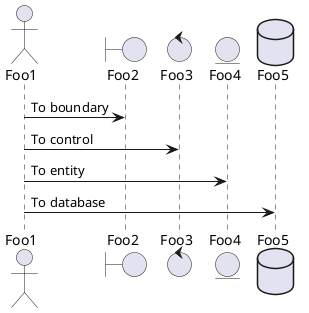
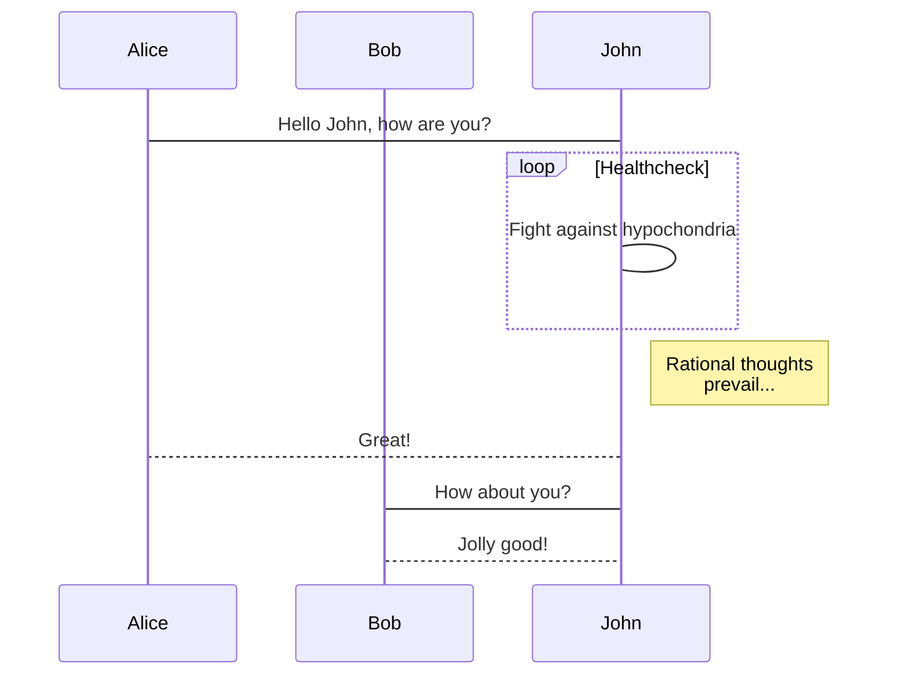
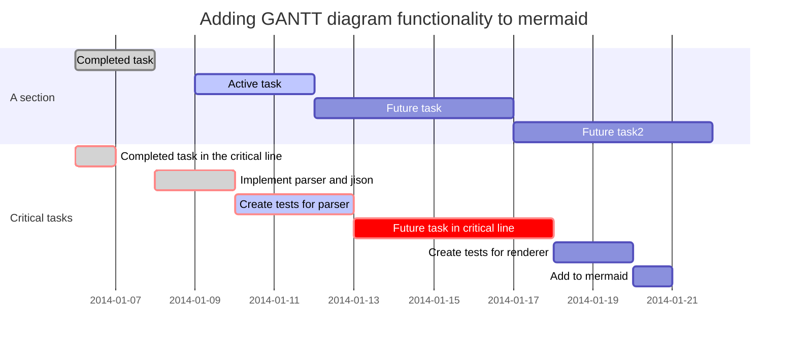

# Diagrams

## PlantUML

Use the following markup to embed [PlantUML](http://plantuml.com/) diagrams:

:::col-md-6

    ```plantuml
    @startuml
    skinparam backgroundColor transparent
    actor Foo1
    boundary Foo2
    control Foo3
    entity Foo4
    database Foo5
    Foo1 -> Foo2 : To boundary
    Foo1 -> Foo3 : To control
    Foo1 -> Foo4 : To entity
    Foo1 -> Foo5 : To database
    @enduml
    ```

:::

:::col-md-6



:::

***

## Mermaid

### Flowcharts

:::col-md-6

    ```mermaid
    graph TD;
        A-->B;
        A-->C;
        B-->D;
        C-->D;
    ```

:::

:::col-md-6


:::

***

### Sequence diagram

:::col-md-6

    ```mermaid
    sequenceDiagram
        participant Alice
        participant Bob
        Alice->John: Hello John, how are you?
        loop Healthcheck
            John->John: Fight against hypochondria
        end
        Note right of John: Rational thoughts <br/>prevail...
        John-->Alice: Great!
        John->Bob: How about you?
        Bob-->John: Jolly good!
    ```

:::

:::col-md-6



:::

***

### Gantt diagram

:::col-md-6

    ```mermaid
    gantt
            dateFormat  YYYY-MM-DD
            title Adding GANTT diagram functionality to mermaid
            section A section
            Completed task            :done,    des1, 2014-01-06,2014-01-08
            Active task               :active,  des2, 2014-01-09, 3d
            Future task               :         des3, after des2, 5d
            Future task2               :         des4, after des3, 5d
            section Critical tasks
            Completed task in the critical line :crit, done, 2014-01-06,24h
            Implement parser and jison          :crit, done, after des1, 2d
            Create tests for parser             :crit, active, 3d
            Future task in critical line        :crit, 5d
            Create tests for renderer           :2d
            Add to mermaid                      :1d
    ```

:::

:::col-md-6



:::